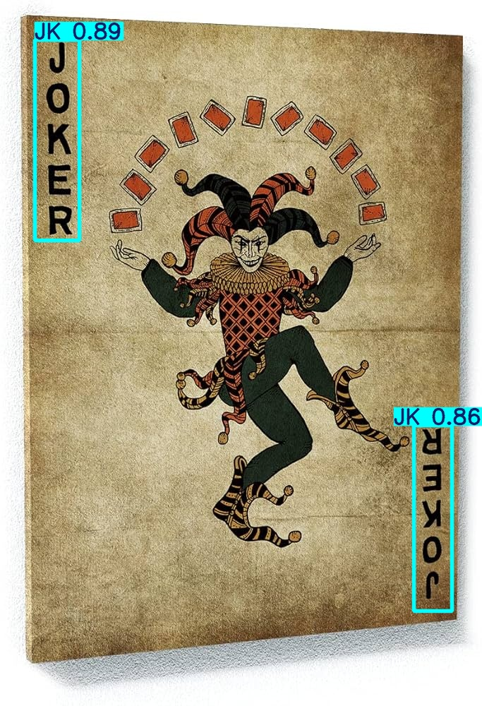
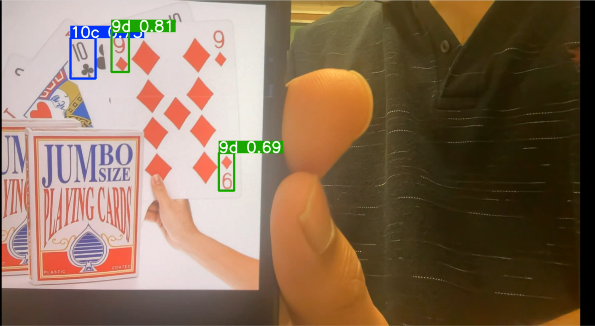

# Playing Card Detection and Classification Using YOLOv8

This project utilizes **YOLOv8**, a state-of-the-art object detection model, to detect and classify playing cards in images and videos. The workflow includes data preprocessing, training, validation, and testing, with results visualized in both image and video formats.

---

## **1. YOLOv8**

YOLOv8 (You Only Look Once, version 8) is an advanced object detection model known for its speed and accuracy. YOLOv8 introduces several enhancements:

-   Improved architecture for better feature extraction.
-   Native support for PyTorch and ONNX.
-   Simplified APIs for training, validation, and inference.

We chose YOLOv8 for this project due to:

-   Its ability to handle real-time detection.
-   Optimized performance for small datasets.
-   Compatibility with Apple’s **M1 GPU** using the `mps` device.

---

## **2. Data Preprocessing**

To ensure the model is trained effectively, the dataset underwent the following steps:

-   **Annotation**: Using tools like **LabelImg** to annotate bounding boxes for playing cards.
-   **Organization**: Dataset was structured into `train/`, `val/`, and `test/` folders, with `images/` and `labels/` subfolders.
-   **Dataset Configuration**: A `data.yaml` file was created, specifying:
    -   Paths to training, validation, and testing datasets.
    -   Number of classes and their names.

---

## **3. Training**

The training process involved fine-tuning YOLOv8 on the playing card dataset.

### **Key Training Parameters**

-   **Image Size**: `416` pixels (balancing performance and accuracy).
-   **Batch Size**: `8` (optimized for limited GPU memory).
-   **Epochs**: `100` (adequate for convergence without overfitting).
-   **Mixed Precision**: Enabled for faster training with `half=True`.
-   **Device**: `mps` (Apple M1 GPU support).

```python
from ultralytics import YOLO

# Load YOLOv8 model
model = YOLO('yolov8n.pt')

# Train model
results = model.train(
    data='data.yaml',
    epochs=100,
    imgsz=416,
    batch=8,
    workers=2,
    device='mps',
    half=True,
    save=True,
    save_period=10
)
```

## **4. Validation & Testing**

The trained model was evaluated on validation and test datasets to measure performance metrics like mean Average Precision (mAP).

### **Validation**

The model's performance was validated on unseen data:

```python
metrics = model.val()
print(metrics)
```

### **Testing**

Testing was conducted using the test dataset defined in data.yaml:

```python
metrics = model.val(data='data.yaml', split='test')
```

### **Performance Metrics**

-   mAP50-95: Average precision across IoU thresholds from 50% to 95%.
-   Recall-Confidence Curve: Analyzed to understand the trade-off between detection sensitivity and prediction confidence.

## **5. Results**

### **Image Detection**

The trained model was used to detect and classify playing cards in test images:



### **Video Detection**

The model was tested on videos for real-time detection:

[](live_feed_output.mp4)
